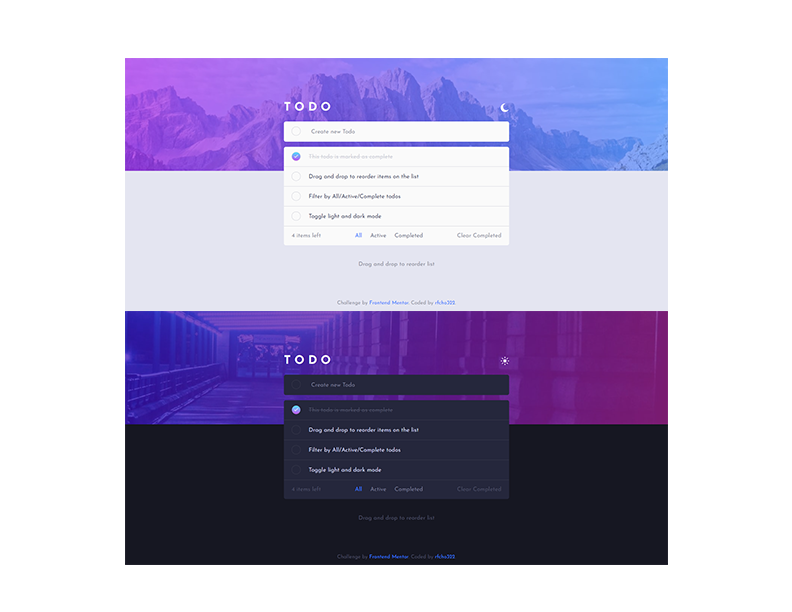
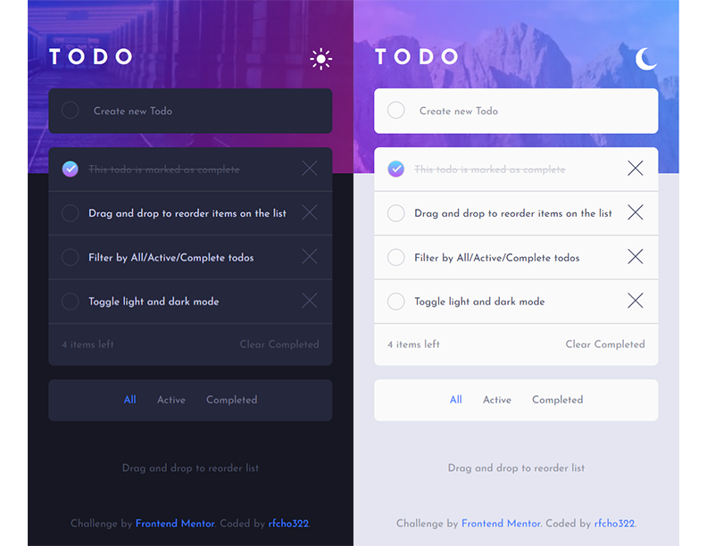

# Frontend Mentor - Todo app solution

This is a solution to the [Todo app challenge on Frontend Mentor](https://www.frontendmentor.io/challenges/todo-app-Su1_KokOW).

## Table of contents

- [Overview](#overview)
  - [The challenge](#the-challenge)
  - [Screenshot](#screenshots)
  - [Links](#links)
- [My process](#my-process)
  - [Built with](#built-with)
  - [What I learned](#what-i-learned)
  - [Continued development](#continued-development)
  - [Useful resources](#useful-resources)
- [Author](#author)

## Overview

### The challenge

Users should be able to:

- &#9989; View the optimal layout for the app depending on their device's screen size
- &#9989; See hover states for all interactive elements on the page
- &#9989; Add new todos to the list
- &#9989; Mark todos as complete
- &#9989; Delete todos from the list
- &#9989; Filter by all/active/complete todos
- &#9989; Clear all completed todos
- &#9989; Toggle light and dark mode
- &#9989; **Bonus**: Drag and drop to reorder items on the list
- &#11036; **Bonus**: Build this project as a full-stack application (**SOON** check here [Continued development](#continued-development))

### Screenshots

<p align="center">
  <strong>Desktop</strong>
</p>
<p align="center">
  
</p>
<p align="center">
  <strong>Mobile</strong>
</p>
<p align="center">
  
</p>

### Links

- Frontend Mentor solution URL: [Todo App Solution](https://www.frontendmentor.io/solutions/a-drag-and-drop-todo-app-HQMrC2t1Uz)
- Live Site URL: [Todo App Live Website](https://rfcho322.github.io/fem-todo-app/)

## My process

### Built with

- Semantic HTML5 markup
- CSS
- Vanilla JS
- Flexbox
- Mobile-first workflow

### What I learned

There's a particular part of my css that applies a border gradient color as you hover on an unticked checkbox, and I'm trying to work it exactly as the design provided by Frontend Mentor, it is a bit tricky as I'm not yet familiar with linear and radial gradients but I somehow achieved it. If you're reading this and not able to achieve it, Check the code snippet below &#128513; &#128513;

```css
.round-checkbox input[type="checkbox"]:not(:checked) + .checkbox-label:hover {
  border: 1px solid transparent;
  background-image: linear-gradient(var(--foreground), var(--foreground)), radial-gradient(circle at top left,hsl(192, 100%, 67%), hsl(280, 87%, 65%));
  background-origin: border-box;
  background-clip: content-box, border-box;
  display: inline-block;
}
```

### Continued development

I want to continue this as a fullstack application using NodeJS Express and MongoDB.

### Useful resources

- [SortableJS](https://sortablejs.github.io/Sortable/) - This library helped me to add drag and drop, so simple to use thanks to their documentation and sample implementations.

## Author

- Frontend Mentor - [@rfcho322](https://www.frontendmentor.io/profile/rfcho322)

